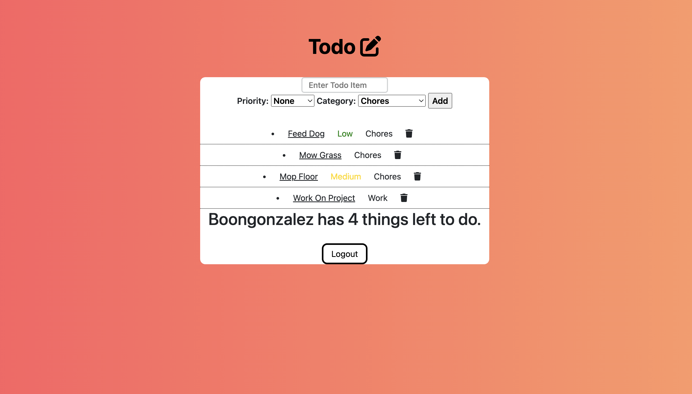

Beer-Helper

Todo list app where users can add todos, categorize and prioritize them.

Link to project: https://group-project-todo-list.herokuapp.com/

Demo User
email: tester1234@gmail.com
password: tester1234

How It's Made:
Tech used: HTML, CSS, JavaScript, Bootstrap, Node.js, Express.js, MongoDB

Optimizations: 

Lessons Learned:
How to add new items into schema.  Using bootstrap to style a page.  Adding colors to classes via css.  

